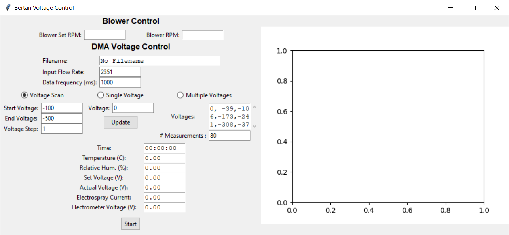

# High Resolution DMA GUI
The high resolution differential mobility analyzer (HR-DMA) is an instrument used to size-select aerosol particles by 
their electrical mobility. HR-DMAs are commonly used in laboratory studies to produce a monodisperse aerosol
sample for experiments such as particle counter calibrations or to measure the size distribution of aerosol particles. The 
HR-DMA uses fast internal flow rates and high voltages provide high sizing resolution. The GUI provided here controls the 
voltage of the HR-DMA and will also read in ion concentrations measured by an aerosol electrometer.

## Getting Started
### Installing
* Clone the repository
* Install the prerequisite packages `docs\requirements.txt`

## Setup
* Set up config file for the HR-DMA `dma_config.ini`

## Running
The HR-DMA voltage can be controllled in three different modes. 

All voltage control methods will auto-generate a output plot. 

### Voltage Scan Mode
* Select Voltage Scan radio button
* Enter start and ending voltage, and voltage step
* Voltage step through the interval, one second per step
* Press Start button to begin

### Constant Voltage Mode
* Select Single Voltage radio button
* Enter in the desired voltage
* Press Start button to begin
* Set voltage can be changed by entering in a new voltage and pressing the Update button

### Discrete Stepping Mode
* Enter in desired voltages as a comma seperated list in the voltages field
* Enter in the number of measurements desired at each voltage, one measurement per second
* Press Start to begin

### Data Output
* Raw data will be ouptut in two formats
    * Measurements are sub-sampled at a rate set in the config file. One data file has all measurements.
    * Averaged data files will have the 1 second-averages of the sub-samples
* Two graphs will be created, viewable in HTML
    * Concentration of ions measured by the aerosol electroemter over time
    * Concentration of ions measured by the aerosol electrometer over HR-DMA voltage

## Authors
Contributor Names

Darren Cheng

## License
This code is licensed under the MIT license